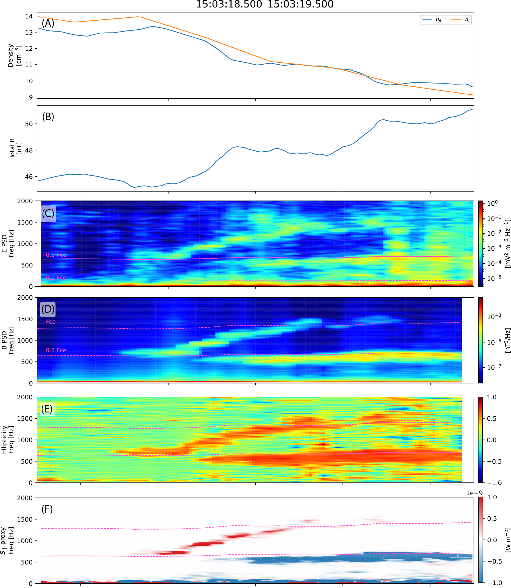

# ELF–VLF Whistler-Mode Wave Ducting and Wave–Particle Interaction

> A research project on how structured magnetospheric plasma guides ELF/VLF whistler-mode waves and controls their interaction with energetic particles.
> 
> 
[← Back to main profile](https://github.com/SANejad)

## Overview

This project studies the connection between **wave ducting**, **wave propagation**, and **wave–particle interaction**. The central premise is that particle acceleration and scattering depend not only on the presence of whistler-mode waves, but also on the propagation pathways that bring those waves into resonance with energetic electrons.

## Scientific motivation

Whistler-mode waves play a central role in radiation-belt dynamics. Chorus waves can accelerate electrons to relativistic energies, while hiss and other whistler-mode emissions can scatter particles into the atmospheric loss cone. The efficiency of these processes depends on wave frequency, amplitude, wave-normal angle, magnetic latitude, propagation direction, plasma density, and magnetic-field strength.

Ducting introduces an additional control on this process. Plasma-density and magnetic-field structures can guide waves along preferred paths, maintain quasi-field-aligned propagation, concentrate wave power, and create localized regions in which resonant wave–particle interaction is enhanced. Ducting is therefore not only a propagation problem; it may also determine where and how energetic particles gain or lose energy.

  

  MMS burst-mode observation of a rising-tone whistler-mode wave packet associated with a magnetic shelf-duct structure.

## Objectives

The project aims to determine how density and magnetic-field structures control whistler-mode wave localization, guiding, leakage, and propagation, and how these propagation changes modify the conditions for resonant interaction with energetic electrons.

## Research approach

The study combines spacecraft observations, three-dimensional reconstruction, plasma-wave diagnostics, and numerical modeling. Observed wave power is compared with local density and magnetic-field structure, while propagation and resonance analyses are used to examine how duct geometry affects wave-normal direction, Poynting flux, spectral power, and particle interaction conditions.

## Main physical questions

- Which density and magnetic-field structures are capable of trapping or guiding ELF/VLF whistler-mode waves?
- How do duct width, gradients, and internal morphology affect wave localization, leakage, and propagation direction?
- How does ducted propagation alter the spatial region in which waves resonate with energetic electrons?
- Under what conditions can ducting enhance localized particle acceleration, scattering, or precipitation?

## Current status

The observational reconstruction, three-dimensional visualization, and wave–duct analysis workflow is under active development.