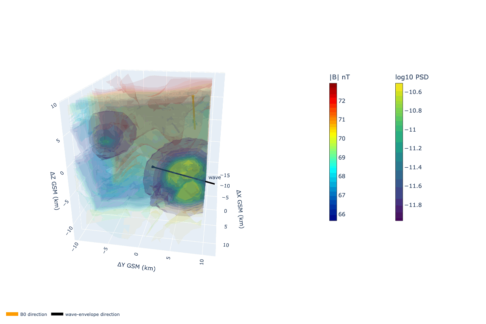

# Plasma Duct Morphology and Whistler-Mode Wave Dynamics

> **A three-dimensional study of how structured plasma environments organize the localization, guiding, and evolution of whistler-mode wave activity.**

[← Back to main profile](README.md)

This project investigates the three-dimensional geometry and time-dependent evolution of plasma ducts that organize whistler-mode wave propagation in the near-Earth magnetosphere. Using multi-spacecraft observations, three-dimensional reconstruction, and numerical modeling, the study examines how magnetic-field intensity, plasma density, and wave-power distributions are arranged relative to one another; how duct boundaries, shelves, and internal gradients evolve; and how these structures control wave localization, guiding, leakage, and changes in propagation direction. The emphasis is on the morphology of the duct environment and the dynamics of the wave field within it. 

  

Spatial reconstructions of a whistler-mode wave trapped inside the low-magnetic duct, observed by an MMS. The magnetic-field structures are shown together with the spatial distribution of wave power. The orange vector indicates the local background-field direction, while the black vector marks the wave-envelope direction. The visualization is used to examine how the observed wave packet is embedded within the surrounding plasma structure and whether its localization and propagation are organized by the duct geometry.</em>

---

## Objective

A plasma duct is a volumetric structure, whereas an individual spacecraft samples only a trajectory through that structure. The central objective of this project is to reconstruct and model the surrounding three-dimensional environment to determine how the observed wave activity is related to the geometry of magnetic-field and density variations. 

The analysis is designed to determine:

- whether enhanced wave power is concentrated inside a distinct magnetic, density, or combined plasma structure;
- how the duct axis and boundaries are oriented relative to the background magnetic field and the wave-envelope direction;
- whether shelf-like, peaked, depleted, or asymmetric duct morphologies produce different wave-power distributions;
- how internal gradients and boundary curvature influence guiding, confinement, leakage, or redirection of the wave packet;
- how the reconstructed structure changes as the spacecraft constellation moves through the event;
- which observed features are consistent with a spatial duct and which may instead reflect temporal evolution.

---

## Research approach

The project combines three complementary elements:

### Multi-spacecraft observations

Measurements from a spacecraft constellation are used to characterize the local magnetic field, plasma density, wave spectra, spacecraft separation, and the timing of the observed wave packet. The multi-point geometry provides the basis for estimating spatial gradients and reconstructing the local plasma environment.

### Three-dimensional reconstruction

Magnetic-field magnitude, density structure, and wave-power distributions are placed in a common local coordinate system. Their relative geometry is then examined through volumetric surfaces, spatial interpolation, spacecraft trajectories, local field directions, and wave-envelope directions. The aim is to identify the shape, orientation, scale, and internal organization of the structure associated with the wave event.

### Numerical studies

Controlled numerical cases are used to test how different duct shapes affect whistler-mode wave behavior. 

---

## Main physical questions

1. **Where is the wave energy located relative to the duct?**  
   Is the strongest wave power centered inside the structure, concentrated near a boundary, or distributed across multiple connected regions?

2. **What defines the duct?**  
   Is the relevant structure primarily magnetic, primarily density controlled, or produced by the combined variation of both quantities?

3. **How does geometry affect propagation?**  
   Do elongated, curved, asymmetric, or shelf-like structures produce different guiding and leakage patterns?

4. **How is the wave oriented inside the structure?**  
   How do the wave-envelope direction, local background field, duct axis, and spacecraft trajectories relate to one another in three dimensions?

5. **How does the structure evolve?**  
   Does the reconstructed morphology remain coherent during the event, or does the apparent duct change as the wave packet develops and the spacecraft constellation moves?

## Current status

The observational reconstruction and visualization workflow is under active development.

